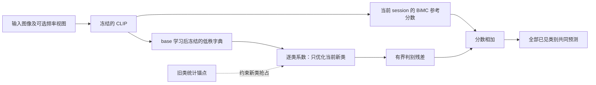

# 面向 BiMC_Freq 的 FSCIL 增量低秩残差设计

日期：2026-09-01。本文记录研究设计。原图低秩分类残差、随机/SVD/episodic 字典、固定支持集和旧类均值约束已实现；频率字典、统计生成锚点和投影 LoRA 仍为后续方案。可执行设置见 [实验协议](D:/WorkSpace/Research/Project/fscil/BiMC_Freq/docs/incremental_residual_experiments.md)。尚无完整受控 benchmark 结果，以下建议不代表已验证增益。

## 1. 推荐结论与能力边界

建议首先实现“冻结稳定表示 + 共享低秩字典 + 逐类残差系数 + 新旧类竞争约束”。base 阶段学习可迁移的残差方向；incremental 阶段只学习新类的少量系数，旧类系数永不覆盖。新知识保存在可以与稳定分类器相加的矩阵中。

第一版属于**固定特征空间中的判别知识学习**，不是视觉编码器学习全新特征。它能重新组合已有信息、修正少样本原型和边界，但不能恢复所有输入特征中都不存在的信息。若实验表明该能力不足，再升级到冻结 Transformer、在视觉投影层旁增加 LoRA 分支。

LoRA 更新的是低秩参数因子，不是把梯度矩阵当作长期知识存储。对线性层而言，W = W0 + BA，W0 冻结，A、B 经梯度下降更新；增量参数是 BA。原始依据：[LoRA](https://arxiv.org/abs/2106.09685)。

## 2. 当前项目的实际起点

| 部分 | 当前行为 | 对新机制的意义 |
| --- | --- | --- |
| CLIP | 图像/文本特征提取使用 no_grad，编码器处于 eval | 已有稳定的表示坐标系；实现时仍应显式 requires_grad_(False) |
| BiMC | 每类视觉、文本、描述原型构成分类器 | 可以保留为完整的参考分支 |
| Frequency V2 | 原图及低、中、高频视图，频率原型、可靠性统计 | 可提供额外判别输入，但三个视图的语义归属不是数学保证 |
| Frequency router | 只在 base 的 pseudo FSCIL episodes 训练 | 可复用 episode 采样思路；当前没有学习新类专属参数 |
| Incremental | build_task_statistics → merge_dicts → evaluation | 需要新增明确的增量优化阶段 |
| 旧类记忆 | state_dict_list 保留所有历史 images_features 和 labels | 当前实现并非“仅原型内存”；这些特征若用于训练，必须标明 feature replay |
| 协方差 | 各 session 的 cov_image 按类别数加权合并 | 即便 backbone、旧原型不变，集成分支仍可能变化 |
| 推理返回值 | forward_ours 返回按 base/novel 分组的集成概率分数 | 不是原始 logits，且拼接后不保证总和为 1 |

主要接口：

- [特征统计与 base router](D:/WorkSpace/Research/Project/fscil/BiMC_Freq/models/bimc.py)：inference_all_img_feature、fit_frequency_router、build_task_statistics。
- [最终预测](D:/WorkSpace/Research/Project/fscil/BiMC_Freq/models/bimc.py)：forward_ours、extract_img_feature、extract_frequency_img_feature。
- [session 管理](D:/WorkSpace/Research/Project/fscil/BiMC_Freq/engine/engine.py)：Runner.run、merge_dicts、inference_task_covariance。
- [support 采样](D:/WorkSpace/Research/Project/fscil/BiMC_Freq/datasets/data_manager.py)：get_dataset、_select_data_from_class_index。
- [现有评估](D:/WorkSpace/Research/Project/fscil/BiMC_Freq/utils/evaluator.py)：calc_accuracy 已返回整体、base、incremental 和 harmonic accuracy，但 Runner 没有完整汇总全部指标。

当前 CUB 配置为 100 个 base 类，随后 10 个 session，每个 session 10-way 5-shot。ViT-B/16 的最终 CLIP 特征为 512 维。后者实现时仍应动态读取，避免写死。

本地 outputs/cub200_router_seed1.log 的已有单次记录是 base 83.66%、最终 73.54%；这只是后续复现实验的参考记录，不足以推出新方案增益，也不能据此选择超参数。

## 3. 主机制：把增量知识保存为低秩原型残差

### 3.1 稳定分支

记冻结的归一化图像特征为 z(x) ∈ R^d。对每个已见类别保存 BiMC 原有的稳定分类原型 p_c^0；新类的 p_c^0 由该类唯一一组 K-shot support 和允许使用的文本信息计算。上标 0 表示“未施加新残差”，不是只包含 base 类。

沿用现有算法，在当前 session 的全部已见类别上计算正值集成分数 v_ref,t,c(x)。定义：

    s_ref,t,c(x) = log(max(v_ref,t,c(x), eps))

后续统一在该分数上添加残差。对全部类别共同归一化后，softmax(s_ref) 与原分数具有相同排序。因此零残差恢复的是**同一 session 原始完整算法的预测排序**，不是声称其跨 session 输出恒定。

必须用 float32 计算参考 log 分数和增量损失，设置 eps 仅用于数值保护。若希望保留原输出值，关闭模块时直接返回原参考分数。

### 3.2 冻结字典，只学习新类系数

base 阶段获得字典 U ∈ R^(d×r)，r 远小于 d。真实 incremental 开始后冻结 U。

为类别 c 新增 a_c ∈ R^r，定义：

    Δp_c = U a_c
    ΔP_t = U [A_0, A_1, ..., A_t]
    e_c(x) = z(x)^T Δp_c = (U^T z(x))^T a_c

其中 A_t 的每一列对应当前 session 一个新类。新增类时追加列，绝不重新训练历史列。第一版令 A_0 = 0，保持 base 类不额外适配。若要学习 base 类残差，应作为独立消融并使用相同记忆协议。

这就是“稳定参数加可累积矩阵”的具体实现。对于线性分类器 W，ΔW = A^T U^T；它是对分类器进行低秩适配，而不是在 Transformer 内部插入完整 LoRA。

该设计也付出明确代价：新类判别方向不在 U 的列空间内时会欠拟合；冻结旧系数意味着不能利用后来信息修正旧类最初的 5-shot 估计误差。提高 rank 或增加 session 私有方向能扩展容量，但需要另行检验过拟合、内存增长和分数可比性。

当 d=512、r=8、一个 session 新增 10 类时，新增可训练参数只有 80 个；共享 U 有 4096 个参数，真实增量时不更新。四个独立视图各 r=8 时，新增 320 个系数。总开销还要计入原有原型、语义描述、统计和可选锚点，不能只报告这 80 个参数。

也可用 p_c = normalize(p_c^0 + Ua_c) 得到直观的单原型版本，作为消融。但当前 BiMC 有频率路由、协方差和文本近邻集成，主版本采用完整预测分数上的残差，更容易保持零更新时的算法一致性。两种实现不是完全等价的。

### 3.3 保守融合

推荐：

    s_t,c(x) = s_ref,t,c(x) + δ_c(x)
    δ_c(x) = ρ g_c(x) tanh(e_c(x) / ρ),    ρ > 0
    g_c(x) ∈ [0, 1]

ρ 限制最大分数改变量；g 控制何时采用残差。

- 第一版 g=1，避免一开始引入额外 router 混淆主效应；a_c 初始化为零。
- 第二版可令 g_c = g_query(x) × r_c。r_c 来自 support 样本数、原始特征离散度和增强一致性；g_query 用不含标签的参考置信度、margin、视图分歧、query 与 support 原型的距离等信息。
- 门控规则或小网络必须在 base 模拟增量中确定，真实增量冻结；不能用真实测试标签或真实 session id 路由。
- 不把“模型对旧类很自信”设为无条件关闭残差的规则：对新类的错误高置信度也很常见。
- tanh 饱和会抑制学习；监测饱和比例，并用 norm 约束防止系数无意义增大。

如果只用一个新类专属线性增量，不再加自由 bias，可减少新类整体抬分的自由度。温度、margin 和 ρ 必须与该 log-score 接口一起在 base 验证，不能照搬裸 cosine 的数值。

## 4. base 阶段怎样学习共享 U

### 4.1 最小可行版本

从 base 训练数据构建可复用的判别方向：类均值与易混淆类均值的差，或 base 内少样本原型与独立较多样本原型之间的校正方向。对这些方向做 SVD，取前 r 个方向作为 U。

构建所有方向时只使用 base 训练数据，不能混入实际增量测试集。普通 PCA 和固定随机正交字典均作为对照；PCA 的高方差不一定意味着高判别力，低方差也不等于“安全新知识空间”。

一个具体的残差 SVD 初始化方式是：对每个 base 训练类反复抽取 5-shot 集合 S，以及与 S 不相交的较多样本集合 R。先以纯视觉原型为例，令 p_S = normalize(mean f(S))、p_R = normalize(mean f(R))，构建 e = p_R - p_S；将多个类、多次抽样的 e 按列组成 E ∈ R^(d×M)。对 E 做非中心化截断 SVD：E = LΣV^T，取 U_init = L[:, :r]。它对应最小化 ||E - UC||_F²、约束 U^T U = I 的低秩近似。若先中心化 E，则需要明确均值修正如何处理，不能无意丢弃公共偏差。

U 的列是特征空间中的修正方向，不是类别原型列表，也不保证每列对应“颜色”“纹理”等可命名属性；系数 a_c 可以有正有负，不要求和为 1。共享的是方向，类特定的是这些方向的组合。

残差 SVD 只能提供初始化：e 含有随机采样误差，主奇异方向可能只是最不稳定的方向。即使 U 能很好重建基于更多样本得到的真实修正，也不意味着新类能只凭 5-shot 估计出对应系数。若 p_S 使用视觉/文本融合，纯视觉 p_R 也未必是更优目标，不能把强制逼近 p_R 当成最终训练目标。

### 4.2 推荐研究版本：学习可适配的字典

沿用现有 pseudo FSCIL 数据采样，但新目标是“少量 support 更新系数后，能否帮助独立 query”。

1. base 类划分为 meta-train 与 meta-validation，调参只使用后者；不根据真实 incremental 测试表现选参数。
2. 每个 episode 模拟 many-shot pseudo-old 与 5-shot pseudo-new。
3. 固定 support，依据它建立参考原型；所有 query 不参与该原型的均值、协方差或描述筛选。
4. 内层只根据 support 和允许的 pseudo-old 记忆更新新类系数 A_new。
5. 外层依据 disjoint query 的联合分类与旧类保持损失更新 U；使用可微展开或明确的近似元梯度实现。不能在内层无意 detach U 后期待 query 能训练字典。
6. 验证选择 rank、更新步数、正则、ρ 后固定；可在全部 base 训练类上按所选设置重新学习 U。

可加入 ||U^T U - I||_F²，或通过正交参数化控制字典尺度。若用 QR 重参数化，必须一致变换已有系数，不能只替换 U 而改变当次函数。首版不必引入这个复杂度。

进一步应模拟连续多个 pseudo sessions：已经学到的系数在后续内层更新中冻结。当前单个“old/new episode”不能充分检验跨多个 session 的累积竞争。

双层目标可写成：A_e(U) = Adapt_K(S_e; U)，其中 K 是有限的内层步数，内层只更新当前 pseudo-new 系数；外层最小化各 episode 独立 query 的 L_query(U, A_e(U))，加旧类保持项和字典尺度约束。该设计借鉴“针对少样本适配后的泛化训练”的[元学习思路](https://proceedings.mlr.press/v70/finn17a.html)，不是要求 query 直接提供真实增量类别的修正向量。

U 必须非零初始化，A 从零开始；至少先做一次内层系数更新，再计算用于训练 U 的外层损失，否则 A=0 时残差对 U 的梯度为零。gate 也不应同时设为严格零。对内层过程完整求导与 detach 已拟合系数后的近似不是同一种训练，实验应说明。

在未参与字典初始化或元训练的 base 验证类上，模拟 5-shot 系数学习，再评价独立 query。只能根据这种可实际执行的适配结果选 rank、步数和正则；用 query 的真实修正反推系数，只能作为 oracle 上限。可增加随机正交字典、类混淆差分 SVD、query 分类损失的原型负梯度 SVD 作为初始化对照，但首版不必混合多个字典来源。

## 5. 增量优化目标与遗忘约束

### 5.1 所有已见类别共同参与分类

    L_cls = CE(s_t(x) / T, y),  (x,y) ∈ support_t

softmax 必须覆盖全部已见类别，不能只在当前 10 个新类之间训练，否则看不到新旧冲突。T 是 base 验证得到并冻结的训练/校准设置，不能拿当前支持集重学一个任意的全局温度。

训练与评估使用同一分数定义。由于 reference 原型使用 support 构建，support 上的高精度会乐观，不能以此决定训练很久或选择超参数；优先少步、强正则，并在 base 的独立 query 验证泛化。可做 leave-one-out support 评分作为增强版，但 5-shot 高方差、1-shot 不可用。

### 5.2 用旧类锚点约束新增类别抢占

主协议不回访旧原图，只保存原始特征均值、样本数，以及 base 估计的共享类内协方差或其低秩近似；历史增量类也保存同样的均值和不确定度。

注意两个区别：

- 锚点应来自原始视觉统计，不能直接把视觉/文本混合后的 calibrated prototype 当成真实旧图像均值。
- 当前 cov_image 包含 session 总体变化，不能直接当作 pooled within-class covariance；需要在 base 特征减去各自类均值后另行估计。

可以从均值和收缩协方差生成少量特征锚点 h，并归一化。这属于统计特征回放，必须公开其假设和内存；它只是近似，不能保证覆盖旧类分布尾部。若允许保存真实 frozen features，应单独称为 feature replay 设置、报告每类数量，并给所有对照相同预算。

对旧类锚点 (h,y)，约束：

    L_old = mean [m_h - (s_t,y(h) - max_{c∈new_t} s_t,c(h))]_+²

margin m_h 由 base 验证选择，可根据该锚点在增量优化开始前的参考 margin 设上限，避免不可实现的强约束。可优先采样与新类最接近的旧类，但同时保留少量全局锚点，防止遗漏远处错误。

若增加蒸馏，teacher 应是**当前全部已见类别、当前稳定统计和历史残差固定、新系数为零**的模型，在同一类别空间上比较。只对旧类子向量重归一化后做 KL，无法惩罚新类抢占；由于主版本旧类分数不更新，这样的 KL 甚至可能完全没有训练信号。

### 5.3 正则与一致性

    L = L_cls + λ_old L_old
              + λ_reg Σ_{c∈new_t} ||a_c||²
              + λ_cons L_cons

L_cons 比较同一 support 图片的温和增强下的残差/预测一致性，不要求低频、高频视图拥有完全相同的语义。增强不会增加独立样本数；CUB 的激进裁剪或颜色扰动可能破坏类别细节，不能直接照搬当前强 RandomResizedCrop 配置。

第一版只用前三项，逐项增加复杂度。不要同时叠加若干难以归因的 loss。

### 5.4 可以保证什么

- 冻结编码器保证其确定性推理特征不因梯度更新改变。
- 冻结 U 和历史 a_c 保证历史残差函数不因新列优化被覆盖；前提是其 gate、归一化和预处理输入也固定。若 gate 依赖全部类别的概率，类别扩展仍可改变 gate。
- 在同一 session 固定 reference 与旧残差后，仅优化当前新列时，旧类原始分数不变；新类竞争仍可能改变最终标签。
- 相对上述优化前模型，若一个正确旧样本对所有当前新类的 margin 都大于 ρ，则其结果不会被本次有界新残差翻转。该结论不是对下一 session 或整个数据分布的保证。
- 若所有候选的残差都相对某参考模型变化且各自有界于 ρ，则相应充分条件是 margin 大于 2ρ。
- 旧类均值正交约束不保护整个分布；投影到旧类全部子空间的严格正交补也可能消除细粒度新类需要的共享信息。不作为第一版核心。

## 6. 与频率机制融合

先在原图特征上验证残差机制，再加入四路输入：

    φ(x) = concat[z_original,
                  z_low - z_original,
                  z_middle - z_original,
                  z_high - z_original]

各块使用 base 固定的尺度设置。频率差分用于表达相对原图改变的证据，但并不自动等于“独立新知识”或噪声消除。

采用每块一个字典 U_b 和每类系数 a_c,b：

    e_c(x) = Σ_b (U_b^T φ_b(x))^T a_c,b

这等价于一个块对角共享字典；参数量、贡献和消融都清楚。后续可用 group sparsity 选择少数有效频段，但不应预设所有新类都依赖高频。

比较原图残差、四路残差、三份 original 伪频率对照。保留现有 base router 不再更新，用对照判断额外收益是否来自新类系数，而非改变原算法。

多视图锚点必须尽量保留跨视图相关性：可在 base 上估计拼接特征的共享低秩类内协方差。分别独立生成四路向量可能制造不可能的样本组合。该统计和所有视图均值都要记入内存预算。

## 7. 如果确实需要学习新的视觉表示

### 7.1 优先升级视觉投影层，保留冻结主干

当前 models/clip/model.py 的 VisionTransformer 在 ln_post 后得到 768 维 CLS 状态 u(x)，再通过 visual.proj 得到 512 维表示。可以显式暴露投影前状态，而不先改所有 attention 层。

使用列向量记号（代码中的 visual.proj 是转置布局）：

    z0(x) = normalize(W0 u(x))
    z_s(x) = normalize(W0 u(x) + B_s A_s u(x))
    A_s ∈ R^(r×768), B_s ∈ R^(512×r)

冻结 Transformer 与 W0，每个 session 新建 A_s、B_s，学习后冻结。标准零残差初始化可用随机 A_s、零 B_s；两个因子都初始化为零会使乘积模型的两侧梯度都为零。

rank=4 时，每 session 5120 个因子参数，比主方案的 80 个明显更多。可以先试 base 学好并冻结两侧方向、只学中间 r 维对角系数，以进一步限制 5-shot 的自由度；代价是可塑性受限。

它可以从冻结的 768 维状态中重组原 512 维投影未保留的判别信息；仍不能创造 Transformer 隐藏状态不存在的信息。若投影层仍不足，再试末端 1–2 个 block 的 Q/V LoRA，但训练成本、梯度路径和特征漂移风险会明显增加。

### 7.2 同一适配坐标系计算 query 与 prototype

对属于 session s 的类别 c，计算 p_c,s = mean_{x∈support_c} z_s(x)，再归一化。测试 query 对该类也必须使用 z_s(x)。不能用“最新适配后的 query + 旧坐标系保存的 prototype”直接比较。

所有 session 的专家都用于它们负责的类别，不需要知道测试样本的真实 session id。完整预测仍应是稳定分支加有界、校准后的专家差分，而不是把多个未经校准的 cosine/softmax 随意相加。

各专家的温度、分数可比性、误路由都需要 base 的多阶段 episodes 验证。将所有 BA 累加进一个全局 W 会再次改变旧类表示，失去专家隔离的主要理由。

最终层输出的 frozen features 不足以重算内部 LoRA 的旧表征。投影 LoRA 至少需要投影前统计/缓存；block 内 LoRA 需要相应的中间状态、旧图像或明确的近似生成机制。不能把当前 images_features 直接当成内部 LoRA 的精确回放数据。

不建议第一版就做“每个 session 一套完整 Transformer LoRA，再由 router 选一套”：它同时引入 5-shot 过拟合、原型坐标变化、任务未知路由和推理开销增长。

## 8. 实现顺序与接口草案

建议新建 models/incremental_residual.py，避免把新增训练逻辑全部堆进 bimc.py。

    StableResidualHead
        fit_base_dictionary(base_train, meta_val)
        append_classes(global_class_ids, initial_codes=zeros)
        fit_session(support_features, reference_state, old_memory)
        score_residual(features, global_class_ids)
        freeze_session(global_class_ids)

Runner 的建议执行顺序：

    固定当前 session 唯一的 support sample ids
    → 提取稳定特征与增强视图
    → 按现有流程建立并合并 reference statistics
    → base: 学 U 并冻结；incremental: 仅优化新类系数
    → 保存系数、类别映射、原始均值与所选统计
    → 释放不允许保留的样本特征
    → 在全部已见类上评估

落地时特别注意：

1. **5-shot 不可重复抽样。** 当前 DatasetManager 每次构造数据集可能重新 np.random.choice。训练 loader 与统计 loader 必须共用一次保存的 support ids，再分别施加增强/确定性变换，否则会无意看到超过 5 张独立图片。
2. **先拆分特征与评分接口。** 增加 reference_scores_from_features，使缓存特征、锚点和测试图像经过相同参考评分逻辑。现有 forward_ours 直接接收图片，不适合直接给特征锚点复用。
3. **精确冻结。** eval() 只切换行为，不等于关闭梯度。冻结 encoder、U、旧 codes；optimizer 只接收当前新类 codes。
4. **no_grad 范围。** 冻结特征提取保持 no_grad；残差拟合不放在 inference_task_covariance 的 no_grad 下。内部 LoRA 版本则必须重建可微的适配段前向。
5. **状态合并。** 追加 class_codes、class_ids、raw_means、uncertainty；U 是共享状态，只存一份。基于显式 global class id 合并，不默认 tensor 顺序永远正确。
6. **不要改变历史 gate 的语义而不记录。** 当前 router 输入由全部类 logits 构造，类别增加会改变其统计；保证措辞需保持在“同 session 固定 reference”范围。
7. **完整 checkpoint。** 保存 encoder 标识/权重引用、base router、U、全部 codes、类顺序、support ids、统计、config 和随机状态；session 边界不必保留已结束的优化器。当前 base_vision_prototype 等是普通 Tensor 属性，不是注册的 buffer，不能只保存 model.state_dict() 就宣称可完整恢复。
8. **精度和参数访问。** 残差与损失用 float32；避免全模型 train()。现有 DataParallel 自定义方法访问也需在实现时验证，不应假设封装后可直接调用。

## 9. 实验设计与通过标准

先做单原图、固定字典、小系数的版本，再加入元训练字典、频率、视觉投影 LoRA。所有版本使用相同 backbone checkpoint、数据次序、support ids、文本描述和记忆预算。

| 实验 | 目的 |
| --- | --- |
| 当前 BiMC / Frequency router | 复现参考点 |
| 新模块开启但残差恒零 | 确认参考路径与预测严格一致 |
| 同样数据上学习完整 d 维新类原型残差 | 判断低秩约束是否确实帮助少样本泛化 |
| 随机 / SVD / episodic U | 区分容量、几何先验与元学习效果 |
| r = 4、8、16 | 检查收益与样本量/维数关系 |
| 无旧类约束 / 均值锚点 / 统计锚点 | 测量新类收益是否来自牺牲旧类 |
| 原图 / 四路 / 重复原图 | 验证频率提供真实互补信息 |
| 固定融合 / base 学习门控 | 判断动态门控是否必要 |
| 同预算 projection LoRA | 比较分类器适配与表示适配 |

建议先跑 3 个 seed 排查实现，再至少 5 个独立 support seeds 报告均值与标准差；如改变 class order，单列该实验。测试集绝不用于 early stopping、rank/ρ 选择、gate 阈值和锚点生成。

报告：session accuracy 曲线、平均 session accuracy、最终 accuracy、base 与全部 incremental accuracy、harmonic accuracy、每个历史 session 的 accuracy、旧样本误判为当前新类的比例、特征/分数漂移、参数量、总记忆、训练时间和推理时间。

现有 inc_avg_acc 是历史 incremental sessions 的等权平均，不一定等于所有 incremental 测试图片合并后的 sample-weighted accuracy；论文中明确口径，并补充宏平均类准确率。

令 R[t,j] 为 session t 后、在第 j 组类别测试样本上的准确率，预测始终覆盖当前全部已见类。报告历史组从最佳值到末次的下降，以及固定旧候选集下的分数/准确率变化，区分分类空间扩展引起的竞争和表示/参数变化。不要把 base 初次到最终的差值全称为参数遗忘。

建议的成功标准不是预设提升几个点，而是：增量类和 harmonic accuracy 在多 seed 下改善，旧类损失受控，新增参数/内存可解释，且完整原型残差、随机字典和同预算回放对照无法解释全部收益。

## 10. 相关研究与可主张的贡献

| 工作 | 已有机制 | 对本方案的启示与区别 |
| --- | --- | --- |
| [LoRA](https://arxiv.org/abs/2106.09685) | 冻结原权重，学习低秩因子 | 是参数化依据，不自动提供 FSCIL 的遗忘控制 |
| [BiMC, CVPR 2025](https://openaccess.thecvf.com/content/CVPR2025/html/Chen_Enhancing_Few-Shot_Class-Incremental_Learning_via_Training-Free_Bi-Level_Modality_Calibration_CVPR_2025_paper.html) | CLIP 的训练免费双层模态校准 | 当前稳定参考路径；新增真实 incremental 优化后不可再称整个方法 training-free |
| [Lark, ICCV 2025](https://openaccess.thecvf.com/content/ICCV2025/papers/Shi_Lark_Low-Rank_Updates_After_Knowledge_Localization_for_Few-shot_Class-Incremental_Learning_ICCV_2025_paper.pdf) | 定位参数后做 rank-one backbone 更新 | 说明 FSCIL 低秩增量更新已有直接工作；本文首版冻结 backbone，只优化类特定残差 |
| [Evolving Dictionary Representation, ECAI 2023](https://arxiv.org/abs/2305.01885) | base 联合学习字典与 encoder；incremental 冻结 encoder、更新字典与新类原型 | 本方案真实增量期间连共享字典也冻结，只追加类系数 |
| [TEEN, NeurIPS 2023](https://arxiv.org/abs/2312.05229) | 将新类均值与加权 base 原型融合 | 作为训练免费校准对照；本方案进一步学习少量判别系数并约束旧类竞争 |
| [FDR, ICCV 2025](https://openaccess.thecvf.com/content/ICCV2025/papers/Xue_Feature_Decomposition-Recomposition_in_Large_Vision-Language_Model_for_Few-Shot_Class-Incremental_Learning_ICCV_2025_paper.pdf) | 分解冻结 CLIP 的属性片段并重组校准 | 可借鉴可复用属性，不能把一般的旧知识重组视为新意 |
| [QR-Prompt, CVPR 2026](https://openaccess.thecvf.com/content/CVPR2026/html/Sinha_Quantized_Residuals_to_Continuous_Prompts_for_Few-Shot_Class_Incremental_Learning_CVPR_2026_paper.html) | 视觉文本残差、离散子空间记忆与连续 prompt 组合 | “残差 + 记忆 + 组合”已有相关工作，需清楚区分输出分数残差与 prompt 适配 |

可检验的研究主张是：在冻结 CLIP 的共同坐标系中，通过 base 学习跨类可迁移的低秩判别方向，再以 5-shot 学习并永久保存每类系数；以统一参考分数和新旧类竞争约束控制负迁移；频率差分为该增量表示提供可验证的互补证据。

这是一组待实验验证的设计选择，不是已证明的性能结论或优先权主张。
